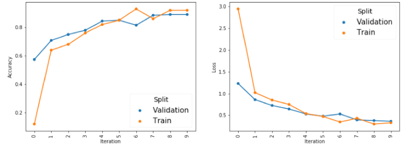
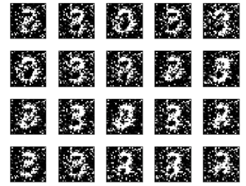
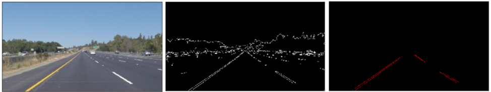
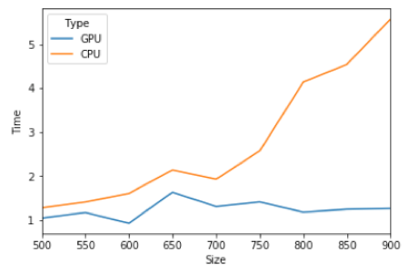

# Deep_Learning_Practice
The purpose of this repository is to practice deep-learning and reinforcement learning. 

## 1. Concepts and Fundamentals
### [Concept Notes.ipynb](Concepts_Notes.ipynb)
- Key concepts in NN
    - Activation Functions
    - Weight Initialization
    - Batch Normalization
    - Gradient Descent and Parameter Update
- CNN 
    - Basics/CNN layers
    - Different CNN network architectures
- RNN 
    - Why RNN doesn't work - Gradient Vanishing
    - LSTM
    - GRU
- Implementation Caveats

### [Recommender_System.ipynb](Recommender_System.ipynb)
- Collaborative Filtering
    - User and Item based
    - Matrix Factorization
    - Deep Learning, and DL-version of SVD
- Ranking Algorithms
    - Evaluation metrics (MAP, NDCG, ...)
    - Modelling Approach (Point-wise, Pair-wise)
- CTR Prediction Model
    - Logistic Regression
    - Factorization Machine
    - Field Factorization Machine
    - GBDT + LR
    - Wide and Deep
    - Deep FM
    - Neural Factorization Machines
    - Deep Interest Network
    - Entire Space Multitask Model 
    - Reinforced Learning
- Feature Engineering
- Cold Start

## 2. Basic Model Applications

### [Neural_Network_Scratch - Part I.ipynb](Neural_Network_Scratch%20-%20Part%20I.ipynb)
- Build neural network from scratch using `numpy` **without** using `Tensorflow` or `Keras`. 
- The notebook includes the **forward** and **backward** propagation of different layers written in `numpy`.
  - [X] Basic Activation Functions
  - [X] Fully-connected Layer 
  - [X] Different Update/Optimization Methods
  - [X] Batch Normalization Layer
  - [X] Drop-out Layer
  - [X] Convolutional layer
  - [ ] Recurrent Layer

### [Neural_Network_Scratch - Part II.ipynb](Neural_Network_Scratch%20-%20Part%20II.ipynb)
- This notebook includes different applications built from components in Part I (DNN, CNN)
- Dataset
  - Synthetic data
  - MNIST (2d, 3d)
  - IRIS
- Gradient check

### [CNN RNN Pratice.ipynb](CNN%20RNN%20Practice.ipynb)
This notebook includes some practice examples to apply tensorflow to build DL models.
- Example 1:
  - Methodology: CNN 
  - Tool: Tensorflow Estimator API
  - Dataset: MNIST

- Example 2: 
  - Methodology: RNN (LSTM)
  - Tool: Tensorflow Estimator API
  - Dataset: Synthetic
  
- Example 3: 
  - Methodology: RNN (LSTM)
  - Tool: Tensorflow Lower-level API
  - Dataset: Synthetic

### [Generative Adversarial Networks (GAN).ipynb](Generative%20Adversarial%20Networks%20(GAN).ipynb)
- Concept Notes on GAN network
- Practice with an example based on MNIST dataset to generate fake digits.

## 3. Popular Packages
### [Tensorflow Practice.ipynb](Tensorflow%20Practice.ipynb)
Practice with Tensorflow package for deep learning models:
- Eager Execution
- Estimator API
    - Built-in classifier
    - Customized classifier
- Dataset API
- Keras with TF backend
    - Sequential model
    - Model class with functional API (LSTM example)
    
    
### [opencv_learn.ipynb](opencv_learn.ipynb)
This notebook works through extensive examples of using `opencv` for image processing
- Basics
    - Thresholds
    - Transformations
    - Filtering
    - Detection
    - Hough Line Transformation
- Example: Traffic Lane Detection

### [openface_learn.ipynb](openface_learn.ipynb)
This notebook applies the `openface` package (http://cmusatyalab.github.io/openface/) on a image similarity calculation problem, and gives some interesting results.

### [GCP_CPU.ipynb](GCP_GPU.ipynb)
A comparison of computational performance between CPU and GPU 
- Implemented a simple CNN model applied on MNIST dataset
- Compare computional performance by running the notebook on a GPU instance on Google Cloud Platform (GCP)

